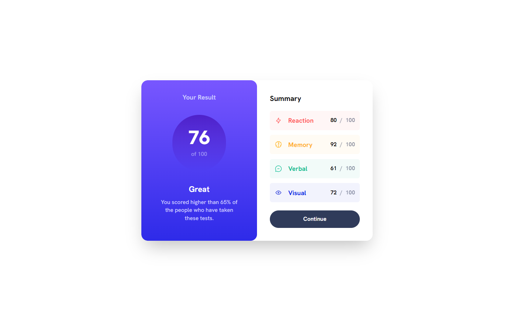

# Frontend Mentor - Results summary component solution

This is a solution to the [Results summary component challenge on Frontend Mentor](https://www.frontendmentor.io/challenges/results-summary-component-CE_K6s0maV). Frontend Mentor challenges help you improve your coding skills by building realistic projects.

## Table of contents

- [Overview](#overview)
  - [The challenge](#the-challenge)
  - [Screenshot](#screenshot)
  - [Links](#links)
- [My process](#my-process)
  - [Built with](#built-with)
  - [What I learned](#what-i-learned)
- [Author](#author)

## Overview

### The challenge

Users should be able to:

- View the optimal layout for the interface depending on their device's screen size
- See hover and focus states for all interactive elements on the page

### Screenshot

### Links

- Solution URL: [GitHub](https://github.com/reinerb/fem-results-summary)
- Live Site URL: [Add live site URL here](http://fem-results-summary-reinerb.vercel.app/)

## My process

### Built with

- Semantic HTML5 markup
- Flexbox & Grid
- Mobile-first workflow
- [React](https://reactjs.org/)
- [Vite](https://vitejs.dev/)
- [TailwindCSS](https://tailwindcss.com/)

### What I learned

This project was primarily to reinforce using a mobile-first workflow for myself.

## Author

- Website - [Ben Reiner](https://btreiner.com)
- Frontend Mentor - [@reinerb](https://www.frontendmentor.io/profile/reinerb)
